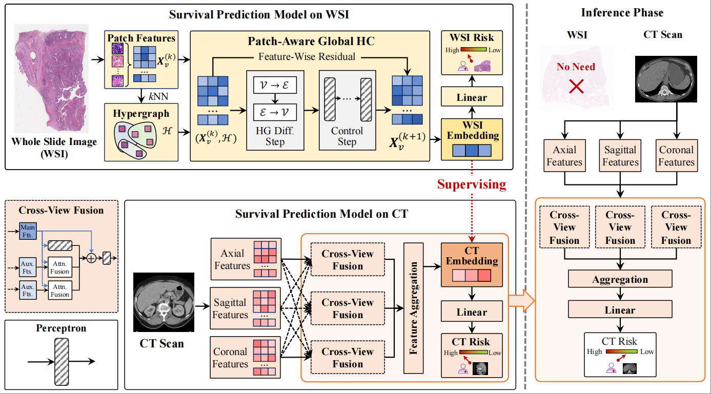

<div align="center">
<h2>Multimodal Hypergraph Guide Learning for Non-Invasive ccRCC Survival Prediction</h2>

<p align="center">
  <b>Jielong Yan, Xiangmin Han, Jieyi Zhao, and Yue Gao<sup>*</sup></b>
</p>

Accepted by _**MICCAI 2025**_
</div>

## Overview
<div>
    
</div>

**Figure 1. The framework of the proposed PAGHC.**

## Cite our work
```bibtex
@inproceedings{yan2025multimodal,
  title = {Multimodal Hypergraph Guide Learning for Non-Invasive ccRCC Survival Prediction},
  author = {Yan, Jielong and Han, Xiangmin and Zhao, Jieyi and Gao, Yue},
  booktitle = {International Conference on Medical Image Computing and Computer-Assisted Intervention},
  year = {2025},
}
```

## License
The source code is free for research and education use only. Any comercial use should get formal permission first.

This repo benefits from [FBNETGEN](https://github.com/Wayfear/FBNETGEN).  Thanks for their wonderful works.
